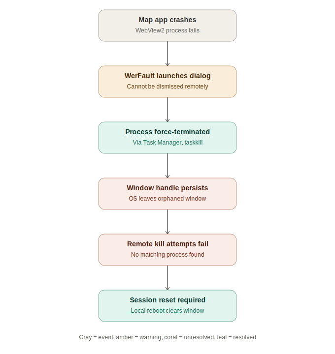
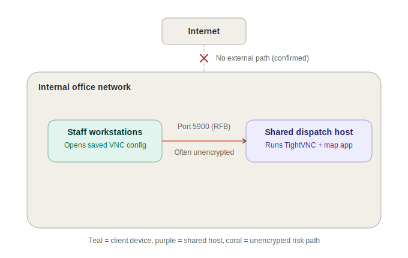

# Internal Attack Surface Review: Legacy VNC-Based Dispatch Display

**Type:** Opportunistic security finding, arising from routine operational troubleshooting
**Category:** Network exposure / remote access hardening
**Status:** Finding documented, remediation recommended, IT informed

---

## Summary

While troubleshooting a frozen application error on a shared operations display (a live driver-tracking map, remotely controlled via VNC by multiple staff), I identified that the underlying remote access setup relied on legacy, largely unauthenticated **VNC (RFB protocol)** with no confirmed encryption in place. This is a common but frequently overlooked class of exposure in internal tooling — infrastructure that predates formal security review and keeps running because "it just works."

This project documents the incident that surfaced the issue, the reasoning behind treating it as a security-relevant finding rather than a one-off IT ticket, and the remediation path a SOC/IT team would reasonably take.

No exploitation was performed. No credentials, IPs, or internal hostnames are reproduced in this repository — all technical details below are described generically, consistent with responsible handling of an internal finding.

---

## Background

Our operations team streams a live GPS-tracked driver map to a shared office display. Staff connect to and control that display from their own desks using a saved VNC viewer configuration file, allowing multiple people to interact with the same remote desktop session as needed (adjusting the map, pulling up other tools, etc.).

During routine use, the remote machine's map application crashed and left a **WerFault.exe (Windows Error Reporting)** dialog permanently on screen — one that could not be dismissed via any remote input (click, keyboard shortcut, or standard process termination methods). Resolving this required escalating through several layers of remote diagnosis before ultimately needing physical, hands-on access from IT.

The troubleshooting process itself is documented separately below, but the more interesting outcome was what it revealed about *how* that shared display is actually accessed — which prompted a closer look at the remote access architecture itself.

---

## Incident Timeline (Troubleshooting Log)

| Step | Action | Outcome |
|---|---|---|
| 1 | Identified error as `WerFault.exe`, code `0xc000012d` (STATUS_INVALID_IMAGE_HASH) | Confirmed as a Windows Error Reporting dialog, not the map app itself |
| 2 | Attempted OK / close via VNC mouse click | No response — dialog unresponsive to remote input |
| 3 | Attempted `Ctrl+Shift+Esc` to open Task Manager | Opened Task Manager on the **local** machine, not the remote host — confirmed VNC session did not have input focus |
| 4 | Used VNC client's dedicated "Ctrl+Alt+Del" toolbar function | Successfully forced input through to the remote session |
| 5 | Opened Task Manager on remote host, searched for `WerFault` | Found process alias **"Windows Problem Reporting"** — ended task |
| 6 | Dialog reappeared / persisted | A duplicate or orphaned instance remained despite process termination |
| 7 | Searched Task Manager (Processes + filtered search) for any WerFault-related entry | **No matching process found at all** — dialog had no backing process |
| 8 | Attempted `taskkill /IM WerFault.exe /F` | No matching process (consistent with GUI findings) |
| 9 | Attempted PowerShell window-title-based termination (`Get-Process \| Where MainWindowTitle -like "*WerFault*"`) | No result |
| 10 | Restarted Windows Explorer (`Stop-Process -Name explorer -Force`) to force a DWM redraw | No effect — window persisted |
| 11 | Reviewed Windows Event Log (`Get-WinEvent`, Application log) for the underlying crash event | Read-only diagnostic step, safe to run, useful for root-cause follow-up |
| 12 | Considered terminating the WebView2 process tree hosting the map itself | **Declined** — would take the live map down for the whole office without confirmed benefit, since the stuck window showed no dependency on that process tree |
| 13 | Escalated to IT for physical/console-level access | Correct call — an orphaned window with no backing process generally requires a session reset (logoff/reboot) rather than remote termination |

**Root cause conclusion:** the visible dialog had become an orphaned window handle — the process that owned it had already exited or been killed, but the window itself was never cleaned up by the OS/DWM. This is a known (if uncommon) Windows behavior and is not remotely resolvable through standard process-termination tooling; it requires a session-level reset.

---

## The Security-Relevant Finding

Troubleshooting this incident meant walking through Task Manager's process tree on the remote host, which surfaced the access method in full: the display is reachable via **TightVNC Server**, using the standard **RFB (Remote Framebuffer) protocol**, with connection details distributed to staff as a saved `.vnc` configuration file.

This raised the natural next question for anyone with a security mindset: **what does this remote access path actually look like from a threat model perspective?**

### Why VNC/RFB is worth flagging

| Concern | Detail |
|---|---|
| **Protocol design** | RFB was not designed with modern security assumptions. Classic VNC authentication uses a weak challenge-response scheme with a historically short effective password length, and is not comparable in strength to modern key-based auth (e.g. SSH). |
| **Encryption is opt-in, not default** | Standard VNC traffic — screen data and keystrokes alike — is unencrypted unless explicitly configured with TLS or tunneled through another secure channel. Whether that was enabled here required direct confirmation from IT, not assumption. |
| **Predictable, scanned port** | VNC conventionally listens on TCP 5900 (+ N for additional displays). This is a well-known port range actively probed by internet-wide scanning tools; if a host is reachable externally even indirectly (misconfigured NAT/port-forward, dual-homed network interface, VPN bridging), it will typically be discovered quickly. |
| **Credential/config distribution** | Saved `.vnc` connection files, distributed to multiple staff desktops, represent a soft target — if any single workstation is compromised, the connection file may provide direct, ready-made access to the shared host without further exploitation. |
| **Blast radius on compromise** | VNC grants full interactive desktop control, equivalent to physical access. No privilege escalation is needed post-access — an attacker has the same capability as any legitimate user of that session. |

### Scope confirmation

Following up with IT confirmed the host is **internal-network only**, with no external bridging, port-forwarding, or VPN exposure — meaningfully reducing the realistic threat model to an *internal/lateral-movement* risk rather than a directly internet-facing one. This is an important and appropriate step: **treating an unconfirmed architecture as exposed until verified**, rather than assuming worst-case without checking, is itself part of doing this kind of assessment properly.

Even scoped as internal-only, the finding remains relevant — internal segmentation failures, compromised endpoints, and insider-risk scenarios are consistently among the most common real-world initial-access vectors in incident postmortems, often more so than external-facing zero-days.

---

## Risk Assessment

| Factor | Rating | Reasoning |
|---|---|---|
| **Likelihood (as scoped: internal-only)** | Low–Medium | Requires an attacker to already have a foothold on the internal network (compromised endpoint, malicious insider, or physical network access) |
| **Impact if exploited** | High | Full interactive control of a machine with saved credentials/sessions, live operational data, and no further privilege barrier |
| **Detectability** | Low (as currently configured) | No indication that VNC connection attempts are logged, alerted on, or monitored |
| **Overall** | Worth remediating | Low-cost fixes available; risk is disproportionate to the effort required to close it |

---

## Recommended Remediation

1. **Verify and enforce encryption** — confirm whether TightVNC's TLS/VeNCrypt options are enabled; if not, enable them, or preferentially:
2. **Tunnel VNC over SSH** rather than relying on RFB's native security — e.g. `ssh -L 5900:localhost:5900 user@host`, with the VNC viewer pointed at `localhost`. This adds strong encryption and auth without replacing existing tooling.
3. **Network segmentation** — place the host on a VLAN isolated from general office traffic, limiting lateral-movement risk even if a workstation is compromised.
4. **Credential hygiene** — avoid embedding passwords in distributed `.vnc` config files; rotate periodically; consider per-user VNC accounts if supported.
5. **Logging/alerting** — enable connection logging on the VNC server and forward to existing monitoring (Sophos/SIEM tooling already present on the host, per process listing) so unexpected connection attempts are visible.
6. **Longer-term** — evaluate whether a modern remote-access alternative (e.g. an authenticated web-based dashboard, or Windows' native remote desktop protocol with NLA) better fits this use case than legacy VNC.

---

## Why This Matters as a Portfolio Piece

This wasn't a simulated lab exercise — it's a real example of the kind of finding that comes from **paying attention during ordinary operational work**, which is a core SOC skill that's easy to undervalue relative to tool-specific certifications. The actual security insight here didn't come from a scanner or a CTF; it came from asking *"wait, how does this actually work under the hood?"* while fixing an unrelated IT issue.

It also reflects a habit worth having as a working analyst: **scoping claims before escalating them.** The instinct to flag VNC as a risk was correct, but the finding wasn't overstated as "critical, internet-exposed" without confirming that with IT first — the write-up reflects the actual, verified risk level, not the worst-case headline version.

---

## Disclaimer

This repository is a **descriptive writeup**, not a technical exploitation guide. No scanning, credential capture, or unauthorized access was performed or is described here. All identifying details (hostnames, IPs, internal application names) have been generalized or omitted. This project is intended solely to demonstrate security awareness, risk-assessment reasoning, and professional documentation practice.
